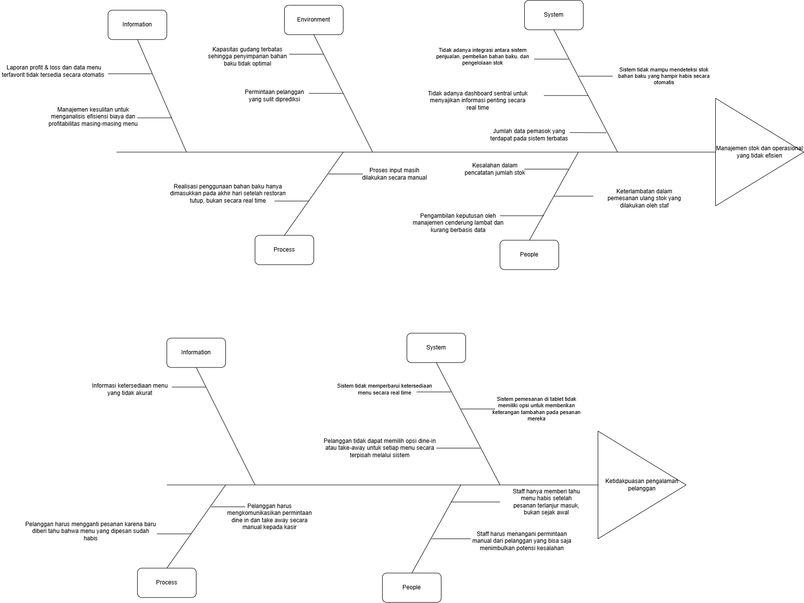
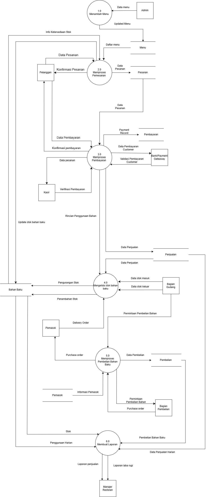
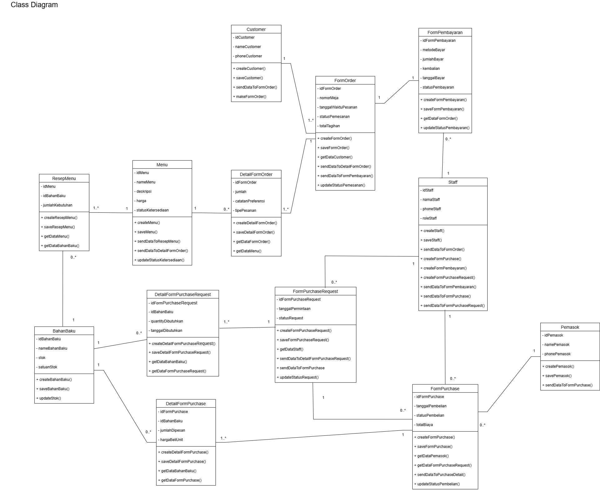
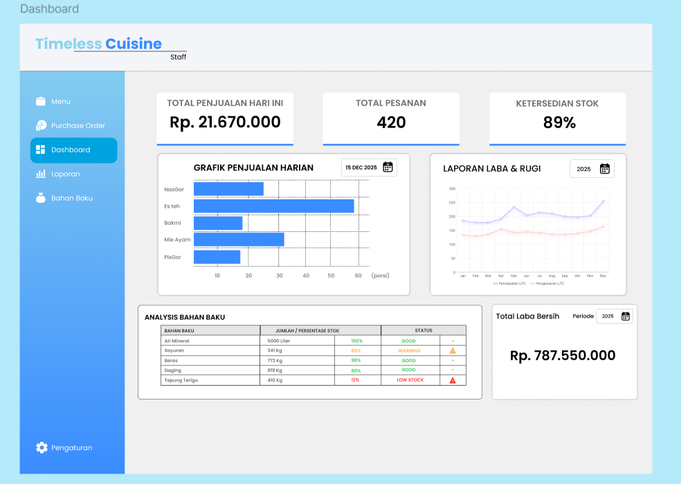

# Timeless Cuisine Restaurant 
An end-to-end Information Systems Analysis and Design (ISAD) case study for a modern restaurant management platform, covering root-cause problem identification, structured process modeling, object-oriented software design, UI mockups, and 3-tier architecture specification.

### Project Overview
Timeless Cuisine addresses critical operational bottlenecks common in traditional restaurant environments, including manual inventory tracking, delayed stock deduction, lack of automated P&L reporting, and ordering miscommunications. This project delivers a complete software specification to integrate customer self-ordering, cashier POS, kitchen/warehouse inventory synchronization, and central management oversight into a single unified system.

### Problem Analysis 
Fishbone Diagram was formulated across people, process, system, environment, and information dimensions to isolate the key drivers of operational inefficiencies and poor dining experiences.

### Process & Data Modeling
The system workflows and information streams are modeled using structured analysis tools:
* **Context Diagram & Data Flow Diagram (DFD Level 0):** Mapped data transactions among Customers, Cashiers, Warehouse Staff, Purchasing Staff, Vendors, and Management.
* **Process Domains:** Order Placement, Payment Processing, Daily Stock Usage Realization, Purchase Requests, Purchase Orders, and Profit/Loss Reporting.

### Object-Oriented Analysis & Design
Detailed behavioral and structural diagrams modeled in UML:
* **Use Case Diagrams & Descriptions:** Documented user scenarios, preconditions, postconditions, and exception handling for 6 operational roles.
* **Activity & Sequence Diagrams:** Detailed end-to-end messaging interactions among actors, boundary/form handlers, entities, and data stores.
* **Class Diagram:** Modeled entities, data types, multiplicity, and method contracts for menus, recipes, orders, inventory items, and purchase forms.
* **State Transition Diagrams:** Defined operational lifecycles for table orders, purchase requests, and payments.

### UI/UX Design & High-Fidelity Mockups
Designed comprehensive static UI mockups across multiple platform touchpoints:
* **Customer Table Kiosk:** Menu exploration, item customization modal, cart confirmation, and order submission interface.
* **Cashier POS Interface:** Order queue list, payment method selection (Cash/Card/QRIS), and receipt generation views.
* **Warehouse & Purchasing Portal:** Daily stock consumption forms, low-stock indicators, purchase request creation, and PO logs.
* **Executive Management Dashboard:** Visual analytics for daily sales, volume distribution, inventory status, and P&L statements.

**Figma:** [Figma Link](https://www.figma.com/design/OVmg8w3DNOblIra6sFzr7n/Timeless-Cuisine?node-id=0-1&t=EXtPSCYlkh6blmN9-1)  
**Diagram Source:** [Draw.io Diagram File](https://drive.google.com/file/d/1rEfsbh4vSqPTZ3axkXrTFf2bClq8r-Z6/view?usp=sharing)

### System Architecture Specification
Designed using a scalable **3-Tier Client/Server Architecture**:
* **Presentation Tier:** Android-based tablet apps for customer dining tables and Windows desktop client for staff.
* **Application Tier:** Java-based backend server handling business logic, transaction isolation, and inventory reconciliation.
* **Data Tier:** Centralized MySQL relational database managing transactional and analytical reporting schemas.

## Contributors
* Aditya Naufal Erlangga
* Arya Raka Pratama
* Thio Michael Yulianto
* Izaty Salsabila
